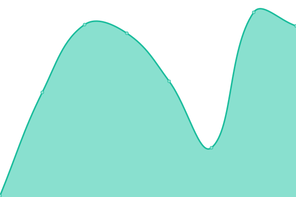
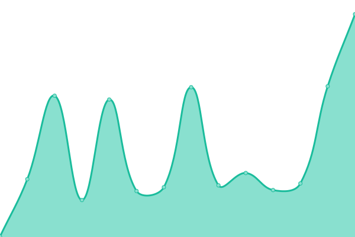

# [📈 Live Status](https://flaxton.github.io/upptime): <!--live status--> **🟧 Partial outage**

This repository contains the open-source uptime monitor and status page for [Fred Laxton](http://infotechdesign.net), powered by [Upptime](https://github.com/upptime/upptime).

With [Upptime](https://upptime.js.org), you can get your own unlimited and free uptime monitor and status page, powered entirely by a GitHub repository. We use [Issues](https://github.com/flaxton/upptime/issues) as incident reports, [Actions](https://github.com/flaxton/upptime/actions) as uptime monitors, and [Pages](https://flaxton.github.io/upptime) for the status page.

<!--start: status pages-->
<!-- This summary is generated by Upptime (https://github.com/upptime/upptime) -->
<!-- Do not edit this manually, your changes will be overwritten -->
<!-- prettier-ignore -->
| URL | Status | History | Response Time | Uptime |
| --- | ------ | ------- | ------------- | ------ |
|  [cloud01](http://cloud01.infotechdesign.ws) | 🟩 Up | [cloud01.yml](https://github.com/flaxton/upptime/commits/HEAD/history/cloud01.yml) | 

 107ms
     
 | 

<a href="https://flaxton.github.io/upptime/history/cloud01">100.00%</a>
    

|  [cloud02](http://cloud02.infotechdesign.ws:8090) | 🟥 Down | [cloud02.yml](https://github.com/flaxton/upptime/commits/HEAD/history/cloud02.yml) | 

 134ms
     
 | 

<a href="https://flaxton.github.io/upptime/history/cloud02">100.00%</a>
    

|  [nextcloud](https://nextcloud.blueridgecs.com/nextcloud/index.php/login) | 🟩 Up | [nextcloud.yml](https://github.com/flaxton/upptime/commits/HEAD/history/nextcloud.yml) | 

 1215ms
     
 | 

<a href="https://flaxton.github.io/upptime/history/nextcloud">100.00%</a>
    

|  [cloud04](http://cloud04.infotechdesign.ws) | 🟩 Up | [cloud04.yml](https://github.com/flaxton/upptime/commits/HEAD/history/cloud04.yml) | 

 119ms
     
 | 

<a href="https://flaxton.github.io/upptime/history/cloud04">100.00%</a>
    

|  [cloud05](https://cloud05.infotechdesign.ws) | 🟩 Up | [cloud05.yml](https://github.com/flaxton/upptime/commits/HEAD/history/cloud05.yml) | 

 113ms
     
 | 

<a href="https://flaxton.github.io/upptime/history/cloud05">100.00%</a>
    

|  [cloud06](https://cloud06.infotechdesign.ws) | 🟩 Up | [cloud06.yml](https://github.com/flaxton/upptime/commits/HEAD/history/cloud06.yml) | 

 350ms
     
 | 

<a href="https://flaxton.github.io/upptime/history/cloud06">100.00%</a>
    

|  [GWC](https://genwealthconcepts.com) | 🟩 Up | [gwc.yml](https://github.com/flaxton/upptime/commits/HEAD/history/gwc.yml) | 

 186ms
     
 | 

<a href="https://flaxton.github.io/upptime/history/gwc">100.00%</a>
    

|  [TMM](https://themoneymultiplier.com) | 🟩 Up | [tmm.yml](https://github.com/flaxton/upptime/commits/HEAD/history/tmm.yml) | 

 236ms
     
 | 

<a href="https://flaxton.github.io/upptime/history/tmm">100.00%</a>
    

<!--end: status pages-->

[**Visit our status website →**](https://flaxton.github.io/upptime)

## 📄 License

- Powered by: [Upptime](https://github.com/upptime/upptime)
- Code: [MIT](./LICENSE) © [Fred Laxton](http://infotechdesign.net)
- Data in the `./history` directory: [Open Database License](https://opendatacommons.org/licenses/odbl/1-0/)
